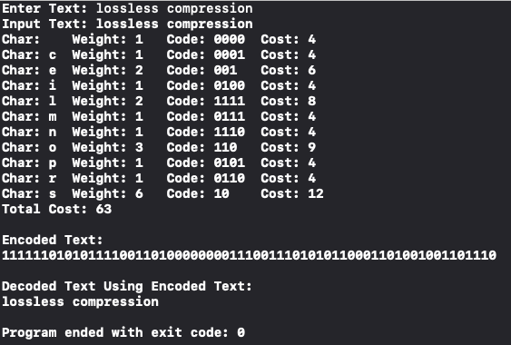

# Huffman Coding Implementation

### Data Structures Involved or Implemented: 
* Binary Tree
* Priority Queue
* Map 

### Time Complexity: 
* O(n*log(n)) 

### Huffman Coding Attributes:   
1. Compresses Data: reduces number of bits needed to represent data 
1. A form of **lossless compression**, meaning no details are lost while compressing
1. Has **variable-length encoding**, whereas in fixed-length encoding, each character has the same length (number of bits) or the same amount of space is used to store each character
   * Fixed-Length Ex: ASCII Codes uses 8 bits (1 byte) for each character 
1. A **greedy algorithm**: combines the **smallest nodes first**, which assigns most rarely used character a longer bit pattern 
   * results in globally optimal encoding tree, yields a minimal per-character encoding/compression
1. Useful when **data is repeated**: fewer bits are used to encode more frequent letters than to encode those less frequent 
1. Has **prefix property**: no bit-sequence of a character is the prefix of any other bit sequence encoding

###  Encoding/Compression/Huffing Program
1. Create single-node trees for each symbol & add it to the priority queue.
1. While there is more than 1 tree in the queue:
  1. Remove the two trees from queue with lowest frequency.
  1. Create a new internal node to be the parent of the new tree. Its weight is equal to sum of children. The children’s parent pointer points to the newly created node. 
  1. Add the new node into queue.
1. A single node in the priority queue is the root node and signifies the tree is complete. The root node should equal the total number of characters in the message.

### Creating Codes Using Huffman Tree
1. Used a map to store bit sequence encodings from Huffman coding tree by following every root-to-leaf path.
2. Read string and processed one character at a time. (Ex: “lossless compression”)
3. A left edge is labeled by a ‘0’ and a right edge is labeled by a ‘1’. A node was compared to its parent’s left child or right child pointer to determine if a bit sequence should append a ‘0’ or ‘1’.

### Sample Input: 

### Resources: 
* https://www2.cs.duke.edu/csed/poop/huff/info/
* https://demo.tinyray.com/huffman
* http://rosettacode.org/wiki/Huffman_coding#C.2B.2B
* https://en.wikipedia.org/wiki/Binary_tree
* https://en.wikipedia.org/wiki/Priority_queue
* https://en.wikipedia.org/wiki/Huffman_coding
* https://en.wikipedia.org/wiki/Heap_(data_structure)#Implementation
* http://pages.cs.wisc.edu/~vernon/cs367/notes/11.PRIORITY-Q.html
